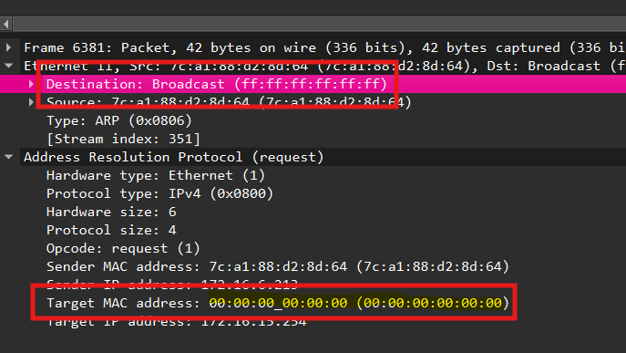

# 1. ARP
- on hold
- Type:0x806, stored in **RAM**, router mac
- frame header *Dst* mac address (**FF**) !== ARP protacal *Tgt* mac address (**00**)

- Note: IPv6 uses a similar process to ARP for IPv4, known as ICMPv6 **Neighbor Discovery (ND)**. IPv6 uses neighbor solicitation and neighbor advertisement messages, similar to IPv4 ARP requests and ARP replies
- ARP poisoning < dynamic ARP inspection (**DAI**)

```
Cisco show ip arp
Windows arp -a, arp -d
```

**quiz: ethernet broadcast**