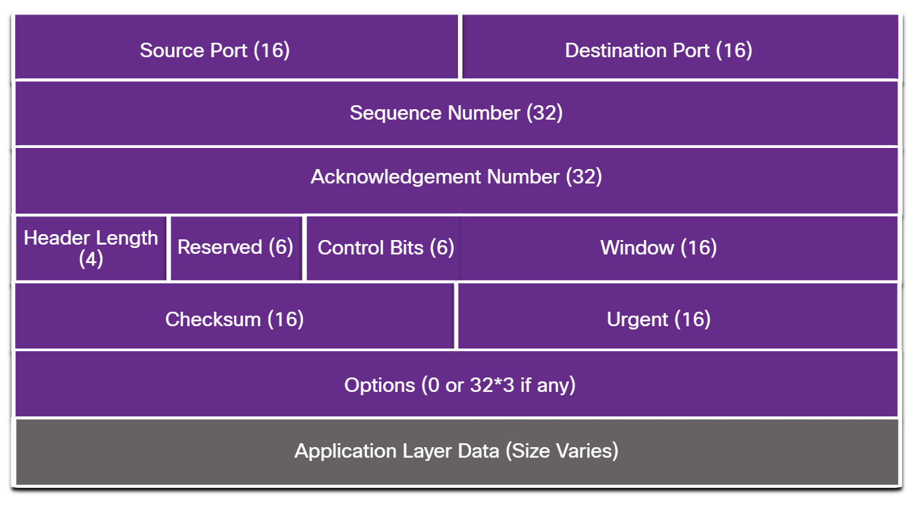

# Special IP

| Category                              | Range                         | CIDR            | Description                                                                                                   |
| ------------------------------------- | ----------------------------- | --------------- | ------------------------------------------------------------------------------------------------------------- |
| **Private (RFC 1918)**                | 10.0.0.0 – 10.255.255.255     | 10.0.0.0/8      | Used inside private networks; not routable on the public Internet.                                            |
|                                       | 172.16.0.0 – 172.31.255.255   | 172.16.0.0/12   | Private networks (often enterprise).                                                                          |
|                                       | 192.168.0.0 – 192.168.255.255 | 192.168.0.0/16  | Common for home routers.                                                                                      |
| **Loopback**                          | 127.0.0.0 – 127.255.255.255   | 127.0.0.0/8     | Returns traffic to the local host; 127.0.0.1 is standard loopback.                                            |
| **Link-local (APIPA)**                | 169.254.0.0 – 169.254.255.255 | 169.254.0.0/16  | Auto-assigned if DHCP fails (Automatic Private IP Addressing). Not routable.                                  |
| **Multicast**                         | 224.0.0.0 – 239.255.255.255   | 224.0.0.0/4     | Used for group communication (e.g., routing protocols, streaming).                                            |
| **Broadcast (limited broadcast)**     | 255.255.255.255               | —               | Broadcasts to all hosts on the local network segment.                                                         |
| **Network & Directed Broadcasts**     | *network*.0 , *network*.255   | —               | First and last addresses in a subnet; vary by mask; used for subnet identification or network-wide broadcast. |
| **Experimental / Research**           | 240.0.0.0 – 255.255.255.254   | 240.0.0.0/4     | Reserved; not normally used; sometimes discussed for future expansion.                                        |
| **Reserved (IANA)**                   | 0.0.0.0 – 0.255.255.255       | 0.0.0.0/8       | Includes “0.0.0.0” (unspecified), used in routing or as a default placeholder.                                |
| **Documentation / Example addresses** | 192.0.2.0/24                  | 192.0.2.0/24    | Used in documentation/examples (TEST-NET-1).                                                                  |
|                                       | 198.51.100.0/24               | 198.51.100.0/24 | TEST-NET-2.                                                                                                   |
|                                       | 203.0.113.0/24                | 203.0.113.0/24  | TEST-NET-3.                                                                                                   |
| **Carrier-grade NAT (CGNAT)**         | 100.64.0.0 – 100.127.255.255  | 100.64.0.0/10   | Used by ISPs for shared address space (RFC 6598).                                                             |
| **Benchmarking**                      | 198.18.0.0 – 198.19.255.255   | 198.18.0.0/15   | Used in network performance testing (RFC 2544).                                                               |
## IP 0.0.0.0

| Context                           | Meaning                                                                                                                                                      |
| --------------------------------- | ------------------------------------------------------------------------------------------------------------------------------------------------------------ |
| **Binding a server**              | When a server binds to `0.0.0.0`, it means **“listen on all interfaces”**. Example: a web server will accept connections on all IPs assigned to the machine. |
| **Routing table / default route** | In a routing table, `0.0.0.0` is used to represent the **default route**, i.e., traffic going **anywhere not explicitly listed**.                            |
| **Host startup / DHCP**           | Before a host has an IP, it may use `0.0.0.0` as its **source IP** when sending a DHCP discover request to get an IP address.                                |
| **Firewall / access rules**       | Sometimes `0.0.0.0/0` is used to indicate **all IPs**, i.e., “allow from anywhere” or “block all IPs”.                                                       |

# Well-know Ports

| Port Number | Protocol | Description                           |
|-------------|----------|-------------------------------------|
| 20          | TCP      | FTP Data Transfer                   |
| 21          | TCP      | FTP Control (Command)               |
| 22          | TCP      | SSH (Secure Shell)                  |
| 23          | TCP      | Telnet                             |
| 25          | TCP      | SMTP (Simple Mail Transfer Protocol) |
| 53          | UDP/TCP  | DNS (Domain Name System)            |
| 67          | UDP      | DHCP Server                        |
| 68          | UDP      | DHCP Client                        |
| 69          | UDP      | Trivial File Transfer Protocal     |
| 80          | TCP      | HTTP (Hypertext Transfer Protocol) |
| 110         | TCP      | POP3 (Post Office Protocol v3)     |
| 143         | TCP      | IMAP (Internet Message Access Protocol) |
| 161         | UDP      | SNMP (Simple Network Management Protocol) |
| 194         | TCP      | IRC (Internet Relay Chat)          |
| 443         | TCP      | HTTPS (HTTP Secure)                |
---
| 465         | TCP      | SMTPS (SMTP Secure)                |
| 514         | UDP      | Syslog                            |
| 587         | TCP      | SMTP (Mail Submission)             |
| 993         | TCP      | IMAPS (IMAP Secure)                |
| 995         | TCP      | POP3S (POP3 Secure)                |
| 1433        | TCP      | Microsoft SQL Server               |
| 3306        | TCP      | MySQL Database Server              |
| 3389        | TCP      | RDP (Remote Desktop Protocol)      |
| 5900        | TCP      | VNC (Virtual Network Computing)    |
| 8080        | TCP      | HTTP Alternate (commonly used for proxies) |

# TCP Header

# Common Service + port

| Protocol                              | Description                                                                                               |
|----------------------------------------|-----------------------------------------------------------------------------------------------------------|
| **Domain Name System (DNS)**           | Resolves internet names to IP addresses.                                                                  |
| **Secure Shell (SSH)**                 | Used to provide remote access to servers and networking devices.                                          |
| **Simple Mail Transfer Protocol (SMTP)** | Sends email messages and attachments from clients to servers and from servers to other email servers.     |
| **Post Office Protocol (POP)**         | Used by email clients to retrieve email and attachments from a remote server.                             |
| **Internet Message Access Protocol (IMAP)** | Used by email clients to retrieve email and attachments from a remote server.                          |
| **Dynamic Host Configuration Protocol (DHCP)** | Used to automatically configure devices with IP addressing and other necessary information to enable communication over the internet. |
| **Hypertext Transfer Protocol (HTTP)** | Used by web browsers to request web pages and by web servers to transfer the files that make up web pages. |
| **File Transfer Protocol (FTP)**       | Used for interactive file transfer between systems.                                                       |

# Model

### 1. **OSI Model**:

* **Physical Layer**: Deals with the transmission of raw data bits over a physical medium.
* **Data Link Layer**: Includes both the **MAC** (Media Access Control) sublayer, which manages access to the physical medium, and the **LLC** (Logical Link Control) sublayer, which provides error checking and frames data.
* **Network Layer**: Responsible for routing data across different networks (e.g., IP addresses).

### 2. **TCP/IP Model**:

* **Network Access**: This is a combination of the **Data Link** and **Physical** layers from the OSI model. It includes both the MAC and Physical layers (covering the media and how data is transferred over the network medium).
* **Network**: This corresponds to the **Network Layer** in OSI, handling addressing and routing (e.g., IP layer in TCP/IP).

### 3. **IEEE 802 Standards**:

* **IEEE 802.3, 802.11, 802.15**: These standards primarily define how data is transmitted over various physical media. They cover both the **MAC** and **Physical** layers in the network stack.
* **IEEE 802.2**: This standard defines the **LLC** (Logical Link Control) sublayer, which sits above the MAC sublayer and handles framing, error correction, and other data link-related tasks.

### Summary:

* **OSI Model** divides the layers into more specific roles (Physical > Data Link > Network).
* **TCP/IP Model** consolidates the **Data Link** and **Physical** layers into a single **Network Access** layer.
* **IEEE 802 Standards** define the actual protocols and technologies for the **Physical** and **MAC** layers (e.g., Ethernet, Wi-Fi), while **IEEE 802.2** defines the **LLC** layer.
v
In simpler terms, the **OSI model** is more abstract and used for theoretical and educational purposes, the **TCP/IP model** is what’s used for real-world networking (especially the internet), and the **IEEE 802 standards** are the technical specifications that define how networks actually operate at the hardware and link level.

| **OSI Model**                    | **TCP/IP Model**        | **IEEE 802 Standards**                              |
|-----------------------------------|-------------------------|-----------------------------------------------------|
| **Physical Layer**                | **Network Access**      | **IEEE 802.3 / .11 / .15 (MAC + Physical)**         |
| Deals with raw transmission of data over physical mediums (cables, radio waves, etc.) | Combines both Data Link and Physical layers | Defines how data is transmitted over networks (Ethernet, Wi-Fi, Bluetooth, etc.) |
| **Data Link Layer**               |                         | **IEEE 802.2 (LLC)**                               |
| Includes **MAC Sublayer** (manages access to the transmission medium) and **LLC Sublayer** (handles error checking, framing) |                         | Defines the LLC sublayer for managing communication between devices |
| **Network Layer**                 | **Network**             |                                                     |
| Responsible for routing data across networks (e.g., IP addresses) | Handles addressing and routing (e.g., IP)         |                                                     |